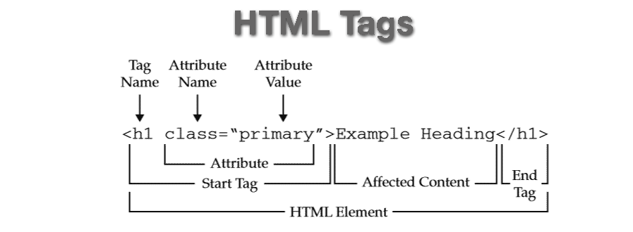

# Nội dung buổi 1

## **I. Cài đặt IDE, Extensions**

### 1. IDE

-   [Visual Studio Code](https://code.visualstudio.com/)

### 2. Extensions

-   [HTML CSS Support](https://marketplace.visualstudio.com/items?itemName=ecmel.vscode-html-css)
-   [Live Server](https://marketplace.visualstudio.com/items?itemName=ritwickdey.LiveServer)
-   [Auto Close Tag](https://marketplace.visualstudio.com/items?itemName=formulahendry.auto-close-tag)
-   [Auto Rename Tag](https://marketplace.visualstudio.com/items?itemName=formulahendry.auto-rename-tag)

## **II. HTML**

-   HTML - HyperText Markup Language: Ngôn ngữ đánh dấu siêu văn bản
-   Sử dụng để tạo ra các trang web.
-   Bao gồm các phần tử được sử dụng để định nghĩa cấu trúc của một trang web.

### 1. Cấu trúc của 1 trang HTML

```html
<!DOCTYPE html>
<html>
    <head>
        <title>Title</title>
    </head>
    <body>
        <h1>Heading 1</h1>
        <h2>Heading 2</h2>
        <p>Paragraph</p>
    </body>
</html>
```

-   **`<!DOCTYPE html>`**: định nghĩa, thông báo cho trình duyệt file hiện tại sử dụng HTML
-   **`<html>`** và **`</html>`**: cặp thẻ bọc tất cả nội dung của trang web
-   **`<head>`** và **`</head>`**: chứa các thông tin về trang web như: tiêu đề, liên kết đến file CSS, JS, meta,...
-   **`<title>`** và **`</title>`**: định nghĩa tiêu đề trang web
-   **`<body>`** và **`</body>`**: chứa toàn bộ nội dung mà trang web hiển thị
-   **`<h1></h1>`**, **`<h2></h2>`**: định nghĩa tiêu đề cho các nội dung hiển thị, có 6 cấp độ tiêu đề từ `<h1>` đến `<h6>`
-   **`<p>`** và **`</p>`**: cặp thẻ định nghĩa một đoạn văn bản

### 2. Các thành phần chính của HTML



-   **Thẻ (Tags)**: HTML sử dụng các thẻ để tạo ra các loại phần tử khác nhau. Ví dụ: `<h1>`, `<p>`, `<a>`, `<div>`,...
-   **Attribute (Thuộc tính)**: Các thuộc tính sẽ cung cấp thêm thông tin cho các phần tử HTML. Ví dụ: `href` trong `<a href="..."></a>` sử dụng để chỉ định đường dẫn của liên kết
-   **Content (Nội dung)**: Các nội dung bên trong thẻ HTML, ví dụ: nội dung của thẻ `<p>...</p>`

### 3. Các thẻ cơ bản

-   **`<h1>`, `<h2>`, `<h3>`, `<h4>`, `<h5>`, `<h6>`**: định nghĩa tiêu đề

```html
<h1>Heading 1</h1>
<h2>Heading 2</h2>
<h3>Heading 3</h3>
<h4>Heading 4</h4>
<h5>Heading 5</h5>
<h6>Heading 6</h6>
```

-   **`<p>`**: định nghĩa một đoạn văn bản

```html
<p>This is a paragraph</p>
```

-   **`<a>`**: định nghĩa một liên kết

```html
<a href="https://google.com">Google</a>
```

-   **``**: chèn một hình ảnh

```html

```

-   **`<ul>`** và **`<ol>`**: định nghĩa danh sách không có thứ tự (unordered list) và có thứ tự (ordered list)

```html
<ul>
    <li>Item 1</li>
    <li>Item 2</li>
    <li>Item 3</li>
</ul>

<ol>
    <li>Item 1</li>
    <li>Item 2</li>
    <li>Item 3</li>
</ol>
```

-   **`<table>`**: định nghĩa một bảng

```html
<table>
    <tr>
        <th>Header 1</th>
        <th>Header 2</th>
    </tr>
    <tr>
        <td>Row 1, Cell 1</td>
        <td>Row 1, Cell 2</td>
    </tr>
    <tr>
        <td>Row 2, Cell 1</td>
        <td>Row 2, Cell 2</td>
    </tr>
</table>
```

-   **`<div>`**: định nghĩa một khối chứa nội dung

```html
<div>
    <p>Content 1</p>
    <p>Content 2</p>
</div>
```

## **III. CSS - Khái niệm cơ bản**

-   CSS - Cascading Style Sheets: Ngôn ngữ mô tả cách hiển thị của các phần tử HTML trên trình duyệt
-   Sử dụng để tạo ra giao diện cho trang web.
-   CSS được sử dụng để định dạng các phần tử HTML như: màu sắc, font chữ, kích thước, vị trí, độ rộng, độ cao,...

## **IV. Github**

-   Github là một dịch vụ lưu trữ mã nguồn trực tuyến
-   Github cho phép người dùng lưu trữ mã nguồn, quản lý phiên bản, hợp tác với nhau
-   Github sử dụng Git để quản lý mã nguồn

### Cách nộp BTVN lên Github

1. Cài đặt Git và liên kết tài khoản: [https://git-scm.com/](https://git-scm.com/)
2. Tạo một repository trên Github
3. Khởi tạo Git trong thư mục chứa BTVN

```bash
git init
```

4. Thêm tất cả các file vào Git

```bash
git add .
```

5. Commit các file đã thêm

```bash
git commit -m "Commit message"
```

6. Liên kết repository trên Github với repository trên máy

```bash
git remote add origin <url>
```

7. Push code lên Github

```bash
git push -u origin master
```
