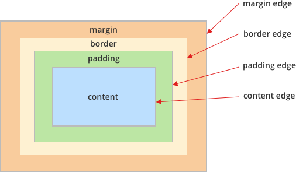
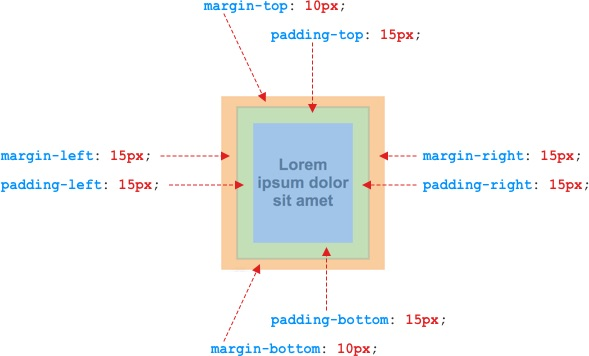
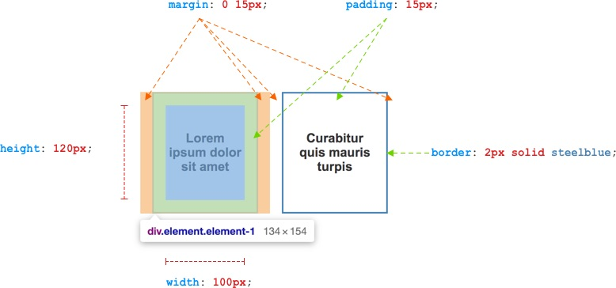
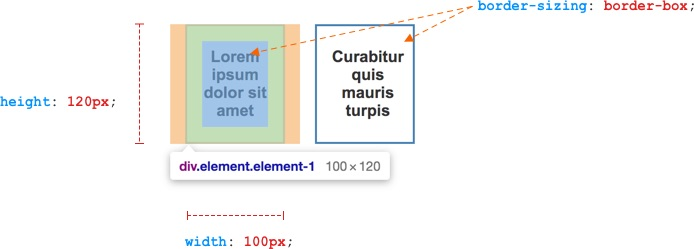

# Nội dung buổi 2

### 1. CSS

-   CSS viết tắt của Cascading Style Sheets
-   CSS là ngôn ngữ tạo phong cách cho trang web viết dưới dạng ngôn ngữ đánh dấu văn bản HTML
-   CSS giúp bạn kiểm soát bố cục của nhiều trang web cùng một lúc

### 2. Bố cục và cấu trúc của một đoạn CSS

`Selector {property: value;}`


-   Selector: vùng chọn là vùng để định nghĩa phong cách cho một phần tử
-   Declaration: khai báo các phong cách
-   Property: thuộc tính để tạo kiểu
-   Value: giá trị thuộc tính tạo kiểu

### 3. Các cách nhúng CSS vào website

1. Inline CSS: Nhúng trực tiếp thẻ css vào đối tượng

```
<h1 style="text-align: center;">
  Xin chào mọi người, tớ tên là <span style="color: red; font-size: 16px"
    >Tùng</span
  >
</h1>
```

_Lưu ý: Khi cấu trúc trang web càng lớn, việc quản lý file sẽ khó khăn nếu sử dụng Inline css, vì nó chỉ áp dụng cho 1 element_

2. Internal CSS:

-   Sử dụng thẻ `<style>` bên trong thẻ `<head>`
-   Viết css ở đầu trang web -> áp dụng kiểu dáng cho toàn bộ trang web

```
<head>
  <style>
    h1 {
      color: white;
      background-color: purple;
    }
    .content {
      color: red;
      background-color: white;
      text-align: center;
    }
  </style>
</head>
```

3. External CSS:

-   Viết css ở 1 file riêng , đặt tên là `<name>.css`
-   Có thể tham chiếu đến nhiều trang web khác nhau
-   Sử dụng thẻ `<link>` để nhúng file vào thẻ `<head>`

VD: file `style.css`

```
body {
  background-color: lightblue;
}
h1 {
  color: green;
}
```

file `Buoi2.html`

```
<head>
  <meta charset="UTF-8" />
  <meta name="viewport" content="width=device-width, initial-scale=1.0" />
  <title>Document</title>
  <link rel="stylesheet" href="b1.css" />
</head>
```

### 4. Comment trong CSS

-   Comment sẽ được trình duyệt bỏ qua, không hiển thị trên trang web
-   Comment 1 dòng hoặc nhiều dòng: `/* ........ */` hoặc nhấn Ctrl + /

### 5. Các thuộc tính CSS cơ bản

1. CSS color

-   `color`: màu chữ trang web

```
color: #ffa400;
color: red;
color: rgb(0,0,0);
```

2. CSS background

-   `background-color`: màu nền
-   `background-image`: ảnh hình nền
-   `background-repeat`: sự lặp lại của hình nền
-   `background-attachment`: cách thức hiện thị hình nền

```
body{
    background-image: url(boxmodel.png);
    background-color: lightblue;
    background-repeat: no-repeat;
    background-attachment: scroll;
}
```

Ngoài ra còn có: background-position, background-size, background-origin, ...

3. CSS Height, Width

-   `length`: Set giá trị tùy chỉnh với đơn vị: px, cm, etc, vh, vw..
-   `auto`: Giá trị mặc định theo trình duyệt
-   `%`: Set giá trị theo phần trăm của phần tử cha
-   `initial`: Set theo giá trị mặc định của nó cho tất cả các thuộc tính css về mặc định
-   `inherit`: Set theo giá trị kế thừa từ phần tử cha
-   `max-width`: Set chiều dài tối đa
-   `min-width`: Set chiều dài tối thiểu

```
p{
  height: 100px;
  width: 50%;
  max-width: 80%;
  min-width: 60%;
}
```

Tương tự cho min-height và max-height

4. CSS Fonts

-   `font-family`: tùy chỉnh font chữ
-   `font-size`: tùy chỉnh kích thước chữ
-   `font-weight`: chọn chế độ bình thường hay in đậm
-   `font-style`: in thường, in nghiêng, hay in xiên
-   `font-variant`: chữ in hoa có kích cỡ nhỏ hơn chữ in hoa bình thường của một font chữ.

```
h1 {
  font-style: italic;
  font-variant: small-caps;
  font-weight: bold;
  font-size: 14px;
  font-family: "Roboto", sans-serif;
}
```

5. CSS Text

-   `text-align`: căn chỉnh text theo chiều ngang

`text-align: center`

-   `text-decoration`: trang trí text

`text-decoration: overline underline line-through;`

-   `line-height`: được sử dụng để chỉ định khoảng cách giữa các dòng

`line-height: 20px`

```
<p style="line-height: 20px; text-align: center">
  Lorem ipsum dolor sit amet, consectetur adipisicing elit.
  <a href="#" style="text-decoration: none">Hey guys</a> Repellat, quia?
</p>
```

Ngoài ra còn có : text-transform, letter-spacing, text-indent, text-shadow, ...

6. CSS Borders

-   `border`: tạo đường viền
-   `border-width`: tạo độ dày đường viền
-   `border-radius`: tạo đường độ cong các góc

```
<div>
  border: 1px soild black;
  border-width: 5px;
  border-radius: 10px;
</div>
```

### 6. Box Model



-   Bất kì element nào trên một trang web, đều được trình duyệt (browser) thể hiện dưới dạng một hình chữ nhật
-   content: Vùng chứa nội dung; thường là text, hình ảnh, video
-   padding: Phần đệm trong suốt bao quanh content
-   border: Đường viền bao quanh phần nội dung và phần đệm
-   margin: Lề bao quanh vùng border



_Chú ý: padding không nhận được giá trị âm và auto, còn margin có nhận được giá trị âm_

Ví dụ


-   `box-sizing`: thuộc tính giúp đơn giản hoá việc xác định và cái đặt kích thước của phần tử (mặc định là content-box)



-   Sử dụng `box-sizing : border-box` thì phần width và height sẽ bao gồm thêm cả padding và border

### 7. Reset CSS

-   Luôn đặt đầu tiên trong các file CSS

```
* {
  margin: 0;
  padding: 0;
  border: 0;
  box-sizing: border-box;
}
```
