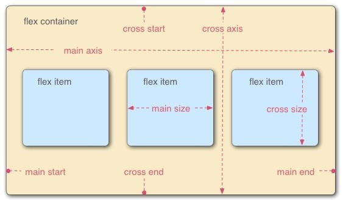
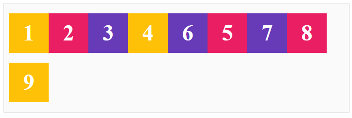
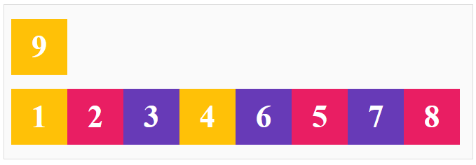

# Nội dung buổi 4

## Flexbox

- Flexbox là một kiểu dàn trang (layout mode), cân đối kích thước của các phần tử bên trong khung của website
- Cấu trúc của flexbox



- 2 thành phần quan trọng nhắt trong 1 bố cục flext box:
  - Container: là phần lớn bao quanh các phần tử bên trong
  - Item: là các phần tử con bên trong container
- Ngoài ra còn:
  - Main start, main end: điểm bắt đầu, điểm kết thúc của container (các item sẽ hiện thị bên trong từ start đến end)
  - Cross start, cross end: tương tự như main start và main end (luôn vuông góc với main strat và main end)
  - Main axis: là trục chính để điều khiển hướng mà các item sẽ hiển thị
  - Main size: là kích thước của item dựa theo trục main axis
  - Cross size: là kích thước của item dựa theo trục cross axis

## Các thuộc tính của flex

1. `display:` thuộc tính dùng để định nghĩa flex container

```
.content{
    display: flex;
}
```

2. `flex-direction:` dùng để chỉ định hướng hiện thị cho item

- `row`: các item sắp xếp theo chiều ngang từ trái qua phải (mặc định)
- `row-reverse`: tương tự row nhung chiều từ phải qua trái
- `column`: các item sắp xếp theo chiều dọc từ trên xuống dưới
- `column-reverse`: tương tự column chiều từ dưới lên trên

_Lưu ý: chiều mặc định của flexbox là từ trái qua phải, từ trên xuống dưới_

```
.content{
    display: flex;
    flex-direction: row-reverse;
}
```

3. `flex-wrap:` dùng để kiểm soát việc bọc các items nằm gọn trong container

- `nowrap`: các item đều nằm trên cùng 1 dòng (mặc định)
- `wrap`: item sẽ tự động xuống dòng
  

- `wrap-reverse`: item sẽ tự động nhảy lên trên
  

4. `flex-flow:` cách viết rút gọn của `flex-direction` và `flex-wrap`

- Trong `flex-flow` giá trị đầu tiên là `flex-direction` và thứ 2 là `flex-wrap`

```
.content{
    display: flex;
    flex-flow: row-reverse wrap;
}
```

5. `justify-content:` dùng để căn chỉnh vị trí của các item so với trục main axis

- `flex-start`: đặt item bắt đầu từ main start (mặc định)
- `flex-end`: đặt item bắt đầu từ main end
- `center`: đặt item ở giữa trục main axis
- `space-between`: các item được phân bổ đều, bắt đầu ở đầu trục và kết thúc ở cuối trục
- `space-around`: các item được phân bổ đều với khoảng cách xung quanh chúng bằng nhau
- `space-evenly`các items được phân bổ sao cho khoảng cách giữa nó đến các cạnh gần chúng bằng nhau

6. `align-items:` dùng để xác định cách mà các flex item được đặt trong container dọc theo chiều cross axis

- `stretch`chiều dài của item sẽ bằng chiều dài của cross axis
- `flex-start` item được đặt ở điểm bắt đầu của cross start (trên cùng bên trái)
- `flex-end` item được đặt ở điểm bắt đầu của cross end (dưới cùng bên trái)
- `center` item được đặt ở giữa điểm bắt đầu của cross start và điểm bắt đầu của cross end (ở giữa bên trái)

7. `align-content` dùng để căn chỉnh vị trí của các item so với trục cros axis

- `stretch`
- `flex-start`
- `flex-end`
- `center`
- `space-between`
- `space-around`

8. `order:` dùng để sắp xếp lại vị trí sắp xếp của các item (mặc định là 0)
9. `flex-shrink:` dùng để co item lại nhiều hơn so với các item khác

```
.content {
 flex-shrink: 2;
}
```

10. `flex-basis:` là gán cho item một kích thước nhất định

```
.content {
 flex-basis: 500px;
}
```

11. `flex-grow:` dùng để tăng kích thước của item trong container khi muốn container không trống (kích thước item < container)

```
.content{
    flex-grow: 1;
}
```

12. `align-self:`tương tự với `align-items` nhưng nó chỉ áp dụng riêng lẻ cho các phần tử muốn thay đổi
13. `gap:` khoảng cách giữa mỗi cột và mỗi hàng

- `row-gap:` khoảng cách giữa mỗi hàng
- `column-gap:` khoảng cách giữa mỗi cột

## Game

https://flexboxfroggy.com/#vi
