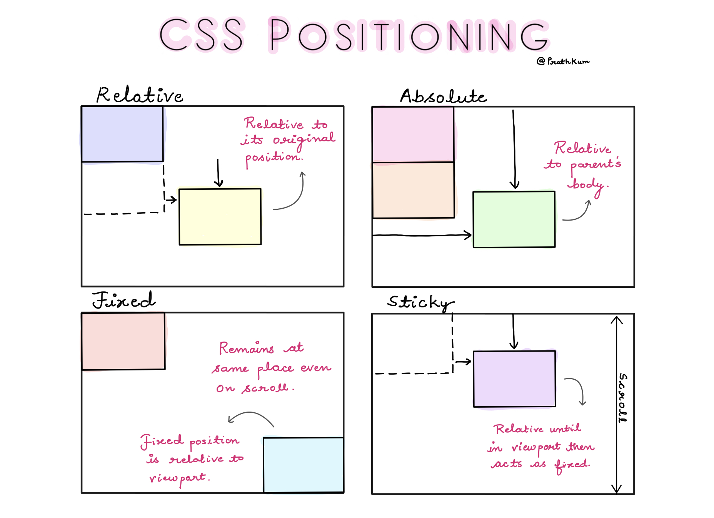

<!-- Position
Animation -->

# Nội dung buổi 5

## **I. Position**



-   **Position** trong CSS giúp chúng ta xác định vị trí của một phần tử trên trang web.

-   Có 5 giá trị của `position`:

    -   `static`
    -   `relative`
    -   `absolute`
    -   `fixed`
    -   `sticky`

-   **Cú pháp**:

    ```css
    selector {
        position: value;
    }
    ```

-   **Ví dụ**:

    ```css
    .element {
        position: relative;
    }
    ```

### 1. Static

-   Giá trị mặc định của mọi phần tử HTML.
-   Hiển thị đúng thứ tự xuất hiện trong bố cục web, không thể thay đổi vị trí của phần tử.

### 2. Relative

-   Vị trí của phần tử sẽ được thay đổi so với vị trí mặc định của nó.

### 3. Absolute

-   Vị trí của phần tử sẽ được thay đổi so với phần tử cha gần nhất có `position` khác `static`.
-   Các phần tử sử dụng `position: absolute` được xóa khỏi luồng của trang, có thể chồng lên phần tử khác.

### 4. Fixed

-   Vị trí của phần tử sẽ được thay đổi so với cửa sổ trình duyệt.
-   Các phần tử sử dụng `position: fixed` không bị ảnh hưởng bởi cuộn trang.
-   Các phần tử sử dụng `position: fixed` không để lại khoảng trống khi chúng biến mất.

### 5. Sticky

-   Phần tử sẽ giữ nguyên vị trí ban đầu cho đến khi nó rời khỏi viewport.
-   Khi phần tử rời khỏi viewport, nó sẽ giữ nguyên vị trí cuối cùng mà nó xuất hiện trong viewport.
-   Phần tử sử dụng `position: sticky` sẽ hoạt động như `position: relative` cho đến khi nó rời khỏi viewport, sau đó nó sẽ hoạt động như `position: fixed`.
-   Các trình duyệt web cũ có thể không hỗ trợ `position: sticky`.

    **_ [Can I use](https://caniuse.com/) _**

### Các thuộc tính đi kèm

-   `top`
-   `right`
-   `bottom`
-   `left`

    ```css
    .element {
        position: relative;
        top: 10px;
        right: 20px;
        bottom: 30px;
        left: 40px;
    }
    ```

-   `z-index`

    ```css
    .element {
        position: relative;
        z-index: 1;
    }
    ```

-   `overflow`

    ```css
    .element {
        position: relative;
        overflow: hidden;
    }
    ```

### Tạo menu đa cấp

-   **HTML**:

    ```html
    <ul class="menu">
        <li>
            <a href="#">Home</a>
        </li>
        <li>
            <a href="#">About</a>
            <ul class="submenu">
                <li>
                    <a href="#">Team</a>
                </li>
                <li>
                    <a href="#">Contact</a>
                </li>
            </ul>
        </li>
        <li>
            <a href="#">Services</a>
        </li>
    </ul>
    ```

-   **CSS**:

    ```css
    * {
        margin: 0;
        padding: 0;
        box-sizing: border-box;
    }

    body {
        display: flex;
        width: 100vw;
        height: 100vh;
        justify-content: center;
        align-items: center;
    }

    ul {
        list-style-type: none;
    }

    li {
        width: 200px;
        text-align: center;
    }

    a {
        text-decoration: none;
        font-size: 32px;
    }

    .menu li {
        display: inline-block;
        position: relative;
    }

    .menu li:hover {
        background-color: #d6d6d6;
    }

    .submenu {
        display: none;
        position: absolute;
        top: 100%;
        left: 0;
    }

    .menu > li:hover .submenu {
        display: block;
    }
    ```

## **II. Animation**

-   **Animation** trong CSS giúp chúng ta tạo ra các hiệu ứng chuyển động cho các phần tử trên trang web.

-   Có 4 thành phần chính của **Animation**:

    -   `@keyframes`
    -   `animation-name`
    -   `animation-duration`
    -   `animation-timing-function`

-   **Cú pháp**:

    ```css
    @keyframes animation-name {
        from {
            /* CSS properties */
        }
        to {
            /* CSS properties */
        }
    }

    selector {
        animation-name: value;
        animation-duration: value;
        animation-timing-function: value;
    }
    ```

-   **Ví dụ**:

    ```css
    @keyframes example {
        from {
            background-color: red;
        }
        to {
            background-color: yellow;
        }
    }

    .element {
        animation-name: example;
        animation-duration: 4s;
        animation-timing-function: ease;
    }
    ```

### 1. `@keyframes`

-   `@keyframes` được sử dụng để tạo ra một animation.
-   `@keyframes` chứa các trạng thái của animation.

### 2. `animation-name`

-   Xác định tên của animation.

### 3. `animation-duration`

-   Xác định thời gian một chu kỳ animation mất để hoàn thành.

### 4. `animation-timing-function`

-   Xác định cách mà animation thay đổi qua thời gian.

    -   `ease`: chậm từ từ ở đầu và cuối, nhưng nhanh ở giữa.
    -   `linear`: chuyển động đều.
    -   `ease-in`: chậm ở đầu.
    -   `ease-out`: chậm ở cuối.
    -   `ease-in-out`: chậm ở đầu và cuối.

    <!-- Position
    Animation -->
